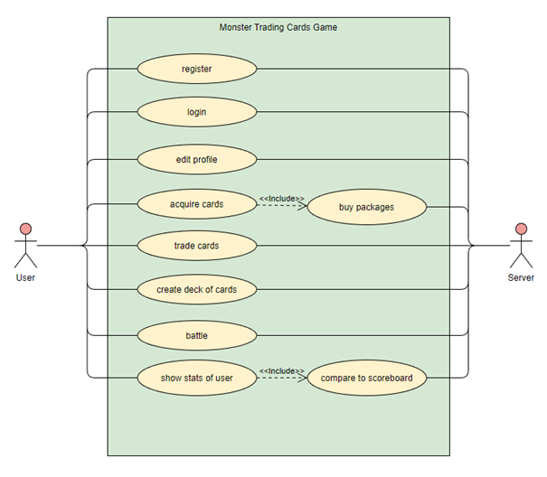
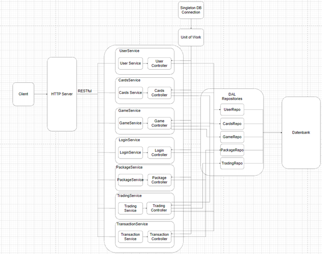
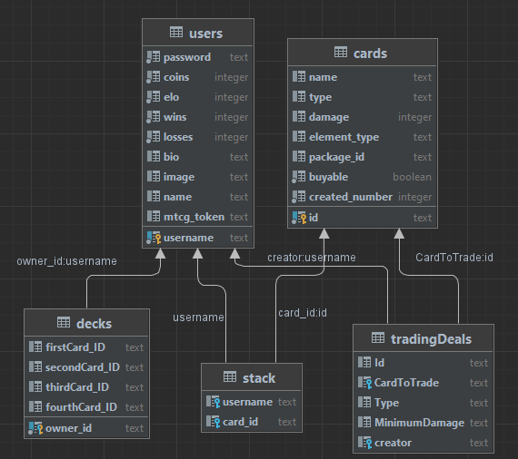

# Monster_Trading_Cards_Game
GitHub repository:  
https://github.com/Warteczek/Monster_Trading_Cards_Game.git
## Overview
This project is the source code for the backend of the Monster Trading Cards Game, which I had to implement during the third semester of my computer science studies at FH Technikum Wien.

## How to start
To start, you have to create a POSTGRES database and the use the provided Database_SQL_Script to generate the tables of the database.  

If you want to change the credentials for the database, go to src/main/java/at.fhtw/dataAccessLayer/DBSingleton and change them in row 13 to 15.
## Documentation
### Design
#### User case diagram

At the begin of semester, as a first step a use case diagram has been made. All use cases are displayed here, in order to get a better understanding of what things the application should be able to do.  

From this use case diagram the architecture for the backend has been derived, which can be seen in the next chapter. The use case diagram was especially important for finding out, which services the application should provide.

#### Architecture of the backend
The following structure has been used for the backend:  

Because the service part of this graphic is a bit confusing, I will describe it in more detail. 

The Service part of each service is responsible for getting the request and to decide which functions of the controller to call. Most of the logic is stationed in the controllers.  

But if a controller needs data from the database, that is when the SingletonDB connection and Unit of Work come into play. There is only one instance of a connection to the database, which every Unit of Work uses.  

All transactions with the database, which need other transaction to be executed as well to be valid, build one Unit of Work. That is why every function in the controllers that needs data from the database, creates a Unit of Work in the beginning of the function, and either commits or rollbacks the transaction in the end. The commit and rollback actions also close this Unit of Work, so that it is not left open forever. The Unit of Work instance is then passed to the repositories, where prepared statements are executed. If the execution is finished, the repositories pass back their result, the routines in the controllers are farther executed. They pass back the results to the Service and so on, until the results reach the client in an appropriate format.

#### Database design

The database structure is shown in the picture above, below the responsibilities of each table will be described:
-	users  
--	saves all userdata
-	cards    
--	saves all existing cards  
--	saves the order in which cards where added
--	saves the information, to which deck the card belongs and if it is still buyable
-	decks    
--	saves a deck for each user
-	stack  
--saves which cards belong to which user
-	tradingDeals  
	saves all trading deals, their creators, and requirements

###	Unique battle feature
The unique battle feature is that when one player wins with more than 30 points difference between the damage values, then this player gets a bonus damage of 10 points for the next round.   

This is done by comparing the final damage values of both players after all specialties and effectiveness effects for the damage are considered, then the bonus is saved into a variable and applied for the next round.

###	Unit tests
For the unit tests I made the decision, that I will run a test for every request possible, for the successful execution of the request. Furthermore, for almost all requests I added unit tests, which check randomly for the required HTTP status codes that should be returned, when a request cannot be successfully executed.

For example, when creating a package of cards, I tried to create a package. If this was successful, I tried to create a package with the same cards and check, if the required HTTP status code 409 was the response from the server.

###	Lessons learned
The most important lesson I learned was how the basic structure of a backend should look like and that there are different models, how a backend can be arranged. Additionally, I learnt how a HTTP-Server handles requests from a client using a REST API.

It was great to refresh the knowledge of multithreading and how to handle concurrent requests to the server at the same time.

Another thing that I must recall for myself is to think about how a database should be structured before starting to program, because if the database is not well structured it always leads to difficulties later.

I also gained some experience with unit tests and understood, why test-driven-development is important.

How to use GitHub correctly was a huge takeaway for me personally.

###	Time spent
- 28.09.2022  
3h, understanding of requirements and structure of the project, building of use case diagram  

- Oktober 2022  
15h, collaborative building of the HTTP server

- 04.11.2022  
1h, embedding of http server and building of basic structure

- 07.11.2022  
3h, setting up the database, understanding the requirements from CURL script, setup of service structure

- 08.11.2022  
2h, connecting to DB, tried to run prepared staments

- 13.11.2022  
2h, user registration service

- 14.11.2022  
1h, user registration service

- 15.11.2022  
2h, modification to Singleton database connection

- 30.11.2022  
2h, modification to Unit of Work, started with login service

- 02.12.2022  
2h, login is completed

- 03.12.2022  
4h,  User Service

- 04.12.2022  
3h, User Service completed, started Package service

- 05.12.2022  
2h, Package Service

- 06.12.2022  
3h, Package Service

- 08.12.2022  
6h, PackageServices completed, started with CardServices

- 12.12.2022  
3h, CardServices completed, started with TradingServices

- 13.12.2022  
3h, TradingService

- 14.12.2022  
3h, TradingService  
2h, GameService

- 20.12.2022  
6h, GameService

- 21.12.2022   
3h, GameService

- 23.12.2022  
3h, adjustments for CURL-Skript

- 27.12.2022  
4h, adjustments for CURL-Skript completed, Game synchronised

- 28.12.2022  
2h, unique battle feature implemented  
4h documentation

#### Total time = 84h

###	GitHub repository
The GitHub repository for the project can be found by clicking the following link:
https://github.com/Warteczek/Monster_Trading_Cards_Game.git